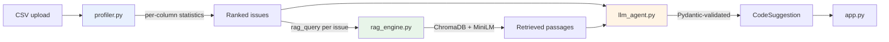

# 🔍 AnalyseIt

**Doc-augmented automated EDA and feature engineering.** Upload a CSV, get a ranked list of data quality problems and runnable pandas code to fix them — generated by an LLM that never sees a single row of your data.

```
Your CSV  ──►  Statistical engine  ──►  Vector DB  ──►  LLM  ──►  Runnable code
              (stays local)           (local)        (aggregates only)
```

---

## The idea

Most "AI data assistants" work by pasting your dataset into a prompt. That leaks your data, breaks on anything larger than a few thousand rows, and produces advice grounded in whatever the model happens to remember.

AnalyseIt inverts that. A deterministic statistical engine does the measuring, a vector database supplies the theory, and the LLM only writes code. Three consequences follow:

**Your data never leaves the process.** The LLM receives aggregates — `skewness: 5.61`, `missing_pct: 40.4`, `iqr_outlier_count: 49` — never rows, category labels or your file's name. This is enforced in code, not just by convention: every prompt is built from one redacted view of the profile (`profiler.llm_view`), and a DataFrame, Series or array reaching the prompt builder — even nested inside the statistics — raises rather than being sent. The tests check the prompts the app actually sends. (Numeric summaries do include min, max and percentiles, which are single values from your data.) Third-party telemetry is off as well: Streamlit's usage stats and ChromaDB's anonymous product events.

**Prompt size doesn't grow with your data.** A request about one column is roughly 1,200–2,300 tokens whether the CSV has 500 rows or 250,000. A dataset-level request (deduplication, scaling) carries at most 40 columns' statistics — about 9,000 tokens even for a 300-column file — so cost and latency are bounded by design.

**Advice is grounded, not recalled.** Every issue the profiler detects carries a retrieval query. A column that is 32.5% missing pulls the passage that says *"Above 30 percent, imputation fabricates the majority of the column"* — and the generated code reflects that rule rather than a generic `fillna(mean)`.

---

## How it works



**1. Profile.** `DataProfiler` computes row/column counts, memory, duplicates, and per-column dtype, missingness, cardinality, skewness, IQR outliers, plus dtype-mismatch detection (numbers or dates stored as text, including `$1,200`, `1.234,56` and `N/A`-style values). Comma-, semicolon-, tab- and pipe-separated files are told apart from the header, and non-UTF-8 Excel exports are decoded. Infinite values and placeholder codes such as `-999` are set aside before the distribution is described, and reported as issues of their own. It then ranks 18 issue types by severity. An optional target column is left out of issue detection — a label is not a feature.

**2. Retrieve.** Each detected issue carries its own query string. `KnowledgeBase` embeds it with `all-MiniLM-L6-v2` and searches a local ChromaDB collection built from `data/ml_docs.txt`. Passages below a 0.45 cosine-similarity cutoff are dropped rather than padded into the prompt.

**3. Generate.** `llm_agent` sends the statistics plus retrieved passages to Claude or GPT and gets back a Pydantic-validated `CodeSuggestion`. All of a column's issues go in one request so the model can't propose a log transform and an outlier clip that contradict each other; dataset-level issues each get their own request.

**4. Present.** Streamlit renders the issues, the reasoning, and the code — checked for syntax validity, unsafe constructs and columns that don't exist in your data before it's shown.

---

## Quickstart

Requires Python 3.11+ (tested on 3.11, 3.12, 3.13 and 3.14).

```bash
git clone <your-repo-url>
cd AnalyseIt
pip install -r requirements.txt

cp .env.example .env        # then uncomment your provider's key line and paste the key
streamlit run app.py
```

The first run downloads the embedding model (~80 MB) and builds the vector index. Subsequent runs reuse both. Profiling works without a key; only generating the cleaning plan calls the LLM.

For the test suite and the sentence-transformers embedding backend, install `requirements-dev.txt` instead (it adds PyTorch, ~2 GB).

### Without the UI

The profiler and knowledge base each run standalone:

```bash
python profiler.py data.csv              # ranked issues for any CSV
python profiler.py data.csv --payload    # the redacted view the LLM receives
python profiler.py data.csv --json       # the full local profile
python rag_engine.py "handling outliers" # search the knowledge base
python llm_agent.py --dry-run data.csv   # print the exact prompts, no API call
```

### Tests and evaluation

```bash
pip install -r requirements-dev.txt
pytest                                   # LLM calls are stubbed or mocked - no key, no cost
pytest -m "not model"                    # the offline subset (no embedding model)
python eval_retrieval.py --compare       # retrieval accuracy + backend agreement
```

---

## Deployment

Built for Streamlit Community Cloud's free tier (1 GB RAM, 1 CPU).

1. Push the repo to GitHub.
2. Create an app at [share.streamlit.io](https://share.streamlit.io): your repo, branch `main`, file `app.py`.
3. Optionally, add a shared key under **Settings → Secrets** (one line, TOML):

   ```toml
   OPENAI_API_KEY = "sk-..."        # or ANTHROPIC_API_KEY = "sk-ant-..."
   ```

Community Cloud only ever installs a file named `requirements.txt`, which is why that file is the slim runtime set: no PyTorch or sentence-transformers, roughly 2 GB less to build. ChromaDB bundles the same `all-MiniLM-L6-v2` model as ONNX, and `rag_engine.py` switches to it automatically — no code change. The two backends agree to within 2e-7 per vector component and give identical retrieval rankings (see below).

Without a shared key the app still profiles every upload; visitors paste their own key in the sidebar to generate plans. With one, runs on it are capped at 5 plans per session and 60 per hour across all visitors.

---

## Design decisions

**Section-aware chunking over fixed-width.** Slicing the knowledge base every 500 characters cuts mid-sentence and strips the heading from every chunk after the first. Chunking on `##` boundaries and prefixing each chunk with its heading yields 36 chunks across 18 sections, none cut mid-sentence. Measured retrieval accuracy: **21/21 top-1** across every query the profiler emits — collected by writing a frame that triggers all 18 issue types to CSV and profiling what comes back, so the test covers what an upload actually produces.

**Retrieval queries are tuned, not assumed.** The outlier query originally read *"...IQR winsorization or robust scaling"* and retrieved the **scaling** section first, because "robust scaling" dominated the embedding. Rephrasing fixed it. Likewise, two natural phrasings of the infinite-values query retrieved the text-to-numeric section; the one in use was chosen by measurement. Near-misses are found by evaluating retrieval rather than eyeballing it.

**Issues are grouped by column before prompting.** A lognormal `income` column fires `high_missing`, `high_skew`, and `outliers` from a single underlying cause. Prompted separately, the model writes three fixes in mutual ignorance. Grouped, it writes one — and when any of a column's issues makes the top N, the column's other issues come along, so the fix is complete. Dataset-level issues (deduplication, scaling) sit at opposite ends of a pipeline, so each gets its own request and its own step.

**Scaling is detected across columns, not within one.** An earlier per-column coefficient-of-variation check fired on any mean-zero column. It was replaced with a comparison of magnitudes across all numeric columns, which is what "these features need scaling" actually means. Binary 0/1 indicators and ID columns are left out of the comparison.

**Placeholder codes are missing values, not outliers.** A `-999` in an age column looks like an outlier and manufactures skew, so clipping it is the obvious — and wrong — fix. The profiler recognises a listed code (`-1`, `-999`, `9999`, …) when it is at least 1% of a column's values and sits outside the range of all the others, reports it, and describes the column's distribution without it.

**Generated code is validated before display.** Every `CodeSuggestion` is parsed with `ast` and walked for forbidden imports (`os`, `subprocess`, `importlib`, `pickle`, …), `eval`/`exec`/`getattr`, file I/O calls and dunder access; comments and strings can neither trigger nor hide a finding. Columns the code reads that don't exist in your data are flagged too. In the downloadable script only validated code is live: the model's prose is flattened into comments, and a step that failed a check is commented out. Column names reach the prompt only JSON-escaped or flattened to one line, and the system prompt treats them as untrusted data.

---

## Verification

Every number below is reproduced by a script in this repo.

| Check | Result | Reproduce |
|---|---|---|
| Retrieval accuracy | 21/21 top-1, all 18 issue types, after a CSV round-trip | `python eval_retrieval.py` |
| Relevance cutoff | lowest expected passage 0.54 vs cutoff 0.45; off-topic queries ≤ 0.12, 0 passages returned | `python eval_retrieval.py` |
| Chunk integrity | 36 chunks, 0 missing headings, 0 mid-sentence cuts | `python eval_retrieval.py` |
| Backend equivalence | sentence-transformers vs ONNX: max component difference 1.9e-7, identical rankings (not byte-identical) | `python eval_retrieval.py --compare` |
| Memory | peak RSS ~540–560 MB with either backend on macOS arm64 (run-to-run noise exceeds the difference); the slim build's saving is install size | `python eval_retrieval.py --memory` |
| Profiler | 49 tests: every detection rule, header-only files, all-NaN columns, mixed types, unicode headers, 60-column frames, cp1252 and BOM files, other delimiters, decimal commas, parse-time sampling | `pytest tests/test_profiler.py` |
| Privacy | the prompts `generate_plan` sends contain no category labels, raw dates or file name, and don't grow with rows or columns | `pytest tests/test_llm_agent.py` |
| Agent guards | 77 tests: DataFrame rejection (nested too), AST safety scan, invented-column check, the response schema sent to each provider, truncation, refusal, no-credit and rate-limit handling against mocked APIs, cache keying, script building | `pytest tests/test_llm_agent.py` |
| UI | 12 Streamlit `AppTest` tests: cold start, provider defaults and switching, upload, plan reset on a new file or target, shared-key cap (failed runs not counted), invented columns, cp1252, semicolon and header-only files | `pytest tests/test_app.py` |

The suite passes with the runtime set on Python 3.11, 3.13 and 3.14 (ONNX backend) and with `requirements-dev.txt` on Python 3.12. The app was also exercised in a real browser: upload, every tab, the target selector, plan rendering, and the error path of a live OpenAI request.

Estimated cost per request with Claude Haiku 4.5 ($1/$5 per MTok): roughly half a cent — about 1,200–2,300 input tokens plus the generated code.

---

## Project structure

```
AnalyseIt/
├── app.py                    Streamlit UI, caching, upload guards, shared-key caps
├── profiler.py               Statistical engine — the only module touching raw rows
├── rag_engine.py             Chunking, embedding, ChromaDB persistence, retrieval
├── llm_agent.py              Pydantic models, prompt assembly, provider calls, code checks
├── eval_retrieval.py         Retrieval evaluation (accuracy, cutoff, backend agreement)
├── tests/                    pytest suite (profiler, agent, knowledge base, UI)
├── data/ml_docs.txt          18-section ML best-practice corpus
├── requirements.txt          Runtime, and what Community Cloud installs (no PyTorch)
├── requirements-dev.txt      + tests and the sentence-transformers backend
└── .streamlit/config.toml    Upload cap as a memory guard; XSRF protection on
```

---

## Limitations

- **Sampling above 250,000 rows.** Larger files are sampled while they are parsed, so only the sampled rows are ever held in memory; the UI says so. This is a memory constraint of the 1 GB deployment target, not of the profiler.
- **Generated code is not executed.** It is validated and displayed for you to review. Read it before running it.
- **Statistics are univariate.** No correlation analysis, multicollinearity detection, or target leakage checks yet.
- **Dates stay text.** A CSV's date columns are reported as `datetime_stored_as_text` rather than converted, so the statistics describe the same DataFrame your own `read_csv` produces.
- **Placeholder detection is a heuristic.** It knows a fixed list of codes and needs them to sit outside the real values; confirm against your data dictionary.
- **The knowledge base is fixed.** Swapping in your own `data/ml_docs.txt` works — the index rebuilds automatically when the file's fingerprint changes, `##` headings start sections, and nothing inside a section is dropped — but there is no UI for it.

---

## Stack

Streamlit · pandas · NumPy · SciPy · scikit-learn · ChromaDB · sentence-transformers (`all-MiniLM-L6-v2`) · Pydantic · Anthropic / OpenAI
