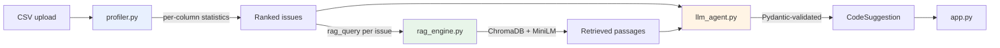

# 🔍 AnalyseIt

**Doc-augmented automated EDA and feature engineering.** Upload a CSV, get a ranked list of data quality problems and runnable pandas code to fix them — generated by an LLM that never sees a single row of your data.

```
Your CSV  ──►  Statistical engine  ──►  Vector DB  ──►  LLM  ──►  Runnable code
              (stays local)           (local)        (aggregates only)
```

---

## The idea

Most "AI data assistants" work by pasting your dataset into a prompt. That leaks your data, breaks on anything larger than a few thousand rows, and produces advice grounded in whatever the model happens to remember.

AnalyseIt inverts that. A deterministic statistical engine does the measuring, a vector database supplies the theory, and the LLM only writes code. Three consequences follow:

**Your data never leaves the process.** The LLM receives aggregates — `skewness: 5.61`, `missing_pct: 40.4`, `iqr_outlier_count: 49` — never values. This is enforced in code, not just by convention: passing a DataFrame to the agent raises rather than sending it.

**Prompt size is constant.** A 500-row CSV and a 50-million-row CSV produce the same ~2,100-token prompt, because both are summarised into the same statistics. Cost and latency don't scale with your data.

**Advice is grounded, not recalled.** Every issue the profiler detects carries a retrieval query. A column that is 32.5% missing pulls the passage that says *"Above 30 percent, imputation fabricates the majority of the column"* — and the generated code reflects that rule rather than a generic `fillna(mean)`.

---

## How it works



**1. Profile.** `DataProfiler` computes row/column counts, memory, duplicates, and per-column dtype, missingness, cardinality, skewness, kurtosis, IQR and Z-score outliers, plus dtype-mismatch detection (numeric or datetime stored as text). It then ranks 16 issue types by severity.

**2. Retrieve.** Each detected issue carries its own query string. `KnowledgeBase` embeds it with `all-MiniLM-L6-v2` and searches a local ChromaDB collection built from `data/ml_docs.txt`.

**3. Generate.** `llm_agent` sends the statistics plus retrieved passages to Claude or GPT and gets back a Pydantic-validated `CodeSuggestion`. Issues on the same column are batched into one request so the model can't propose a log transform and an outlier clip that contradict each other.

**4. Present.** Streamlit renders the issues, the reasoning, and the code — with the generated code checked for syntax validity and unsafe constructs before it's shown.

---

## Quickstart

Requires Python 3.10+ (developed on 3.12.3).

```bash
git clone <your-repo-url>
cd analyseit
pip install -r requirements.txt

cp .env.example .env        # add ANTHROPIC_API_KEY or OPENAI_API_KEY
streamlit run app.py
```

The first run downloads the embedding model (~90 MB) and builds the vector index. Subsequent runs reuse both.

### Without the UI

The profiler and knowledge base each run standalone:

```bash
python profiler.py data.csv              # ranked issues for any CSV
python profiler.py data.csv --json       # the exact payload the LLM receives
python rag_engine.py "handling outliers" # search the knowledge base
python llm_agent.py --dry-run            # print the assembled prompt, no API call
```

---

## Deployment

Built for Streamlit Community Cloud's free tier (1 GB RAM, 1 CPU).

1. Push to a public GitHub repo.
2. Create an app at [share.streamlit.io](https://share.streamlit.io) pointing at `app.py`.
3. **Advanced settings → Requirements file: `requirements-deploy.txt`.**
4. **Settings → Secrets:**
   ```toml
   ANTHROPIC_API_KEY = "sk-ant-..."
   ANALYSEIT_EMBED_BACKEND = "onnx"
   ```

`requirements-deploy.txt` omits PyTorch and sentence-transformers, cutting roughly 2 GB from the build. ChromaDB bundles the same `all-MiniLM-L6-v2` model as ONNX, and `rag_engine.py` detects the missing package and switches backends automatically — no code change. The two backends were verified to produce identical vectors (see below).

The sidebar includes a bring-your-own-key field, so a public deployment doesn't have to spend the owner's quota.

---

## Design decisions

**Section-aware chunking over fixed-width.** Slicing the knowledge base every 500 characters cuts mid-sentence and strips the heading from every chunk after the first. Chunking on `##` boundaries and prefixing each chunk with its heading yields 34 chunks across 17 sections, none cut mid-sentence. Measured retrieval accuracy: **19/19 top-1** across every query the profiler emits.

**Retrieval queries are tuned, not assumed.** The outlier query originally read *"...IQR winsorization or robust scaling"* and retrieved the **scaling** section first, because "robust scaling" dominated the embedding. Rephrasing fixed it. Both near-misses were found by evaluating retrieval rather than eyeballing it.

**Issues are grouped by column before prompting.** A lognormal `income` column fires `high_missing`, `high_skew`, and `outliers` from a single underlying cause. Prompted separately, the model writes three fixes in mutual ignorance. Grouped, it writes one — and when both top issues share a column, that's one API call instead of two.

**Scaling is detected across columns, not within one.** An earlier per-column coefficient-of-variation check fired on any mean-zero column. It was replaced with a comparison of magnitudes across all numeric columns, which is what "these features need scaling" actually means.

**Generated code is validated before display.** Every `CodeSuggestion` is parsed with `ast` and scanned for `os`/`subprocess` imports, `eval`/`exec`, and file I/O. Syntax errors and flagged constructs surface in the UI.

---

## Verification

| Check | Result |
|---|---|
| Retrieval accuracy | 19/19 top-1 across all profiler queries |
| Chunk integrity | 34 chunks, 0 missing headings, 0 mid-sentence cuts |
| Backend equivalence | sentence-transformers vs ONNX: vectors identical to 5 decimals, identical similarity scores |
| Memory | 703 MB (sentence-transformers) vs 593 MB (ONNX) resident |
| Profiler edge cases | Zero-row frames, all-NaN columns, mixed types, unicode headers, 60-column frames |
| Privacy | Asserted that raw category values never appear in the LLM payload |
| Agent guards | 21 offline tests: DataFrame rejection, syntax validation, unsafe-construct scanning, config resolution |
| UI | Streamlit `AppTest`: cold start, provider switching, full render with upload |

Cost per analysis with Claude Haiku 4.5 ($1/$5 per MTok): roughly **half a cent per issue**.

---

## Project structure

```
analyseit/
├── app.py                    Streamlit UI, caching, upload guards
├── profiler.py               Statistical engine — the only module touching raw rows
├── rag_engine.py             Chunking, embedding, ChromaDB persistence, retrieval
├── llm_agent.py              Pydantic models, prompt assembly, provider calls
├── data/ml_docs.txt          17-section ML best-practice corpus
├── requirements.txt          Local development
├── requirements-deploy.txt   Slim deploy (no PyTorch)
└── .streamlit/config.toml    Upload cap as a memory guard
```

---

## Limitations

- **Sampling above 250,000 rows.** Larger files are profiled on a random sample, flagged in the UI. This is a memory constraint of the 1 GB deployment target, not of the profiler.
- **Generated code is not executed.** It is validated and displayed for you to review. Read it before running it.
- **Statistics are univariate.** No correlation analysis, multicollinearity detection, or target leakage checks yet.
- **The knowledge base is fixed.** Swapping in your own `data/ml_docs.txt` works — the index rebuilds automatically when the file's fingerprint changes — but there is no UI for it.

---

## Stack

Streamlit · pandas · NumPy · SciPy · scikit-learn · ChromaDB · sentence-transformers (`all-MiniLM-L6-v2`) · Pydantic · Anthropic / OpenAI
